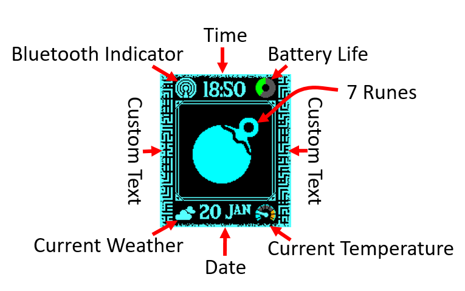
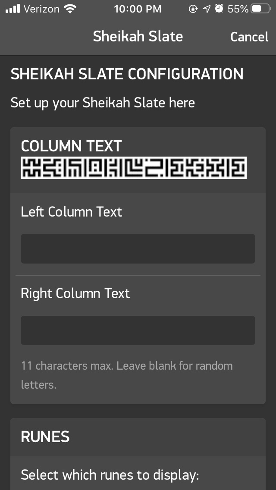

# Sheikah Slate Watchface for Pebble
## Compatibility
| Platform   | Watches  |Compatible|
| ---------- | -------- |----------|
| Aplite     | Pebble Pebble Steel|Yes|
| Basalt     | Pebble Time Pebble Time Steel|Yes|
| Chalk      | Pebble Time Round|**No**|
| Diorite    | Pebble 2 Pebble 2 HR|Yes|
| Emery      | Pebble Time 2|**NO**|
## Layout

## Features
### Time and Date display
Fairly automatic, supports 12 & 24hr display
### Bluetooth Indicator
Displays current bluetooth connection state. Vibrates on disconnect.
### Battery Life
Displays current battery percentage. Turns yellow when charging, and red when very low.
### Custom Text
Allows for up to 11 characters of input per column. Available characters: [A-Z, a-z, 0-9, ., !, ?, space, :].
Can leave the input field in the settings for 11 random letters.
### Current Weather
Displays the current weather conditions using OpenWeather. Can use current location or preset latitude and longitude coordinates.
### Current Temperature
Displays the current temperature using OpenWeather. The thresholds for *very cold*, *cold*, *comfortable*, *hot*, and *very hot* are set in the settings.
Can choose to use Metric (&deg;)C or Imperial (&deg;)F.
### 7 Runes to Choose
Randomly selects one of 7 different runes to display. Can select different runes in settings.
## Customization in Settings
The following are customizable within the settings app:
* Left and Right column text
* Which of the 7 runes to randomly select from
* How often to change which rune is being displayed
* How often to check the weather
* Whether to use the current location when fetching the weather, or pre-specified latitude and longitude coordinates
* Whether to use metric or imperial units for the temperature
* The thresholds for the temperature gauge:
  * Very cold 
  * Cold 
  * Comfortable 
  * Hot 
  * Very hot 

